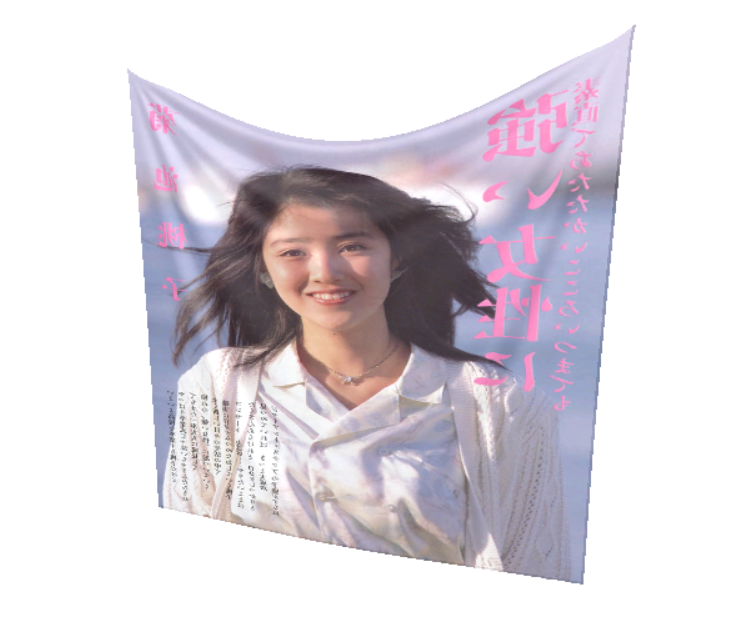
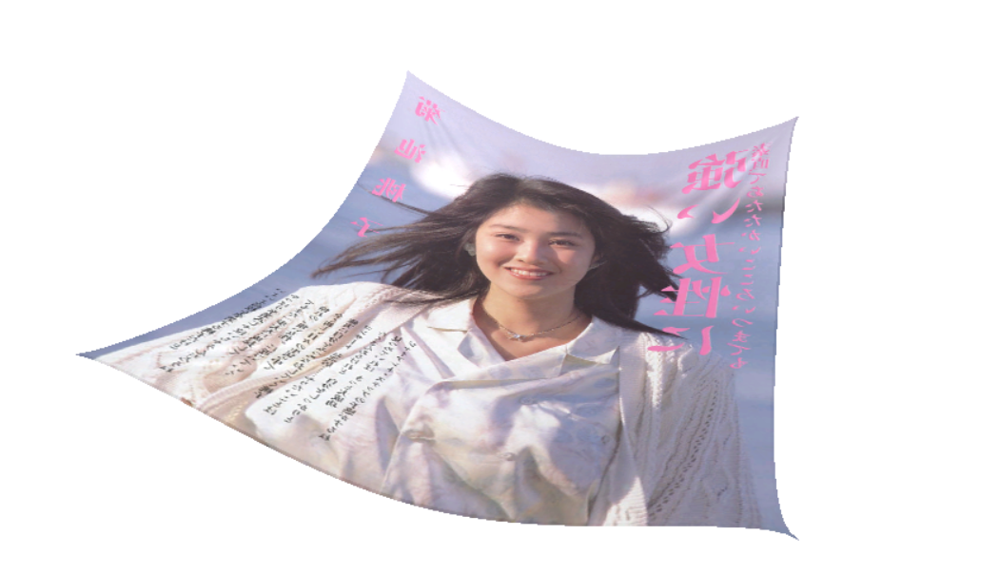

# cloth-simulation-based-on-mass-spring-model-opengl
A Demo of Cloth Simulation Program.
<h1>Demonstrations</h1>
<h3>1. Stationary State</h3>

<h3>2. Stationary State</h3>

<h3>3. Wind</h3>

<h3>4. Release</h3>

